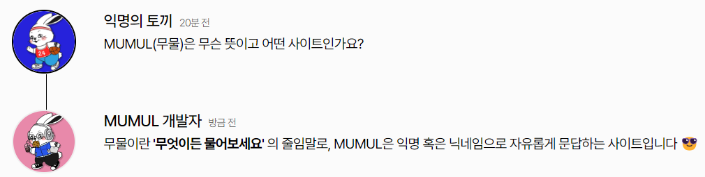
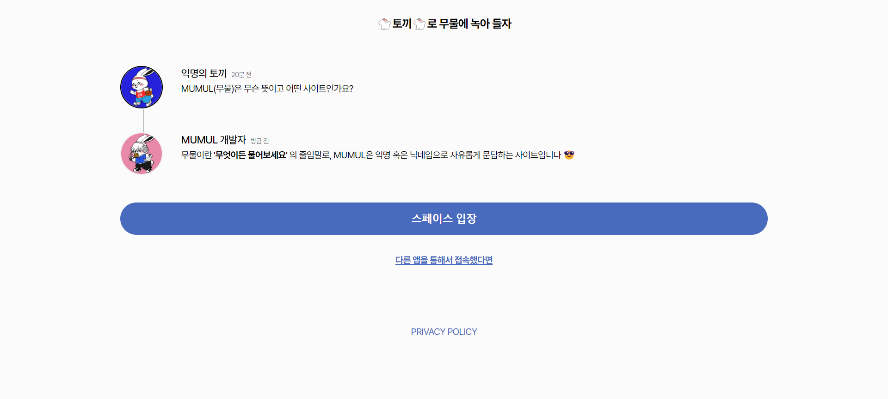
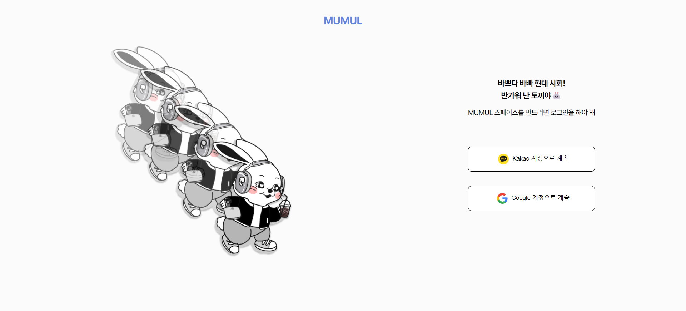
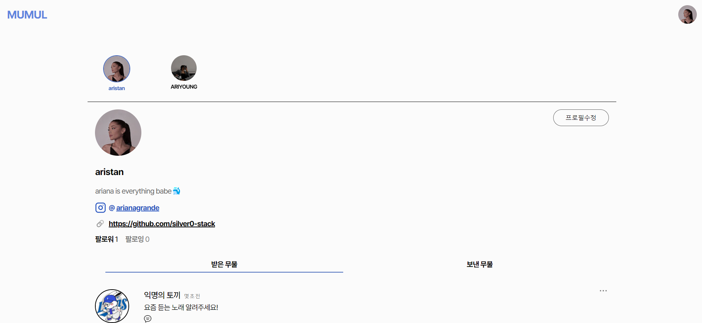
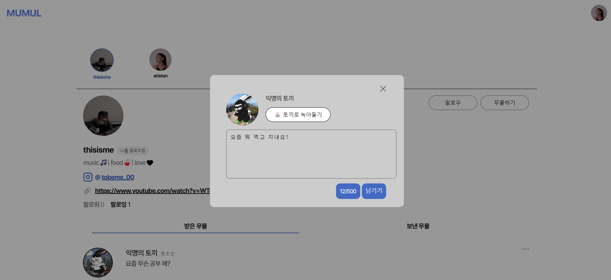
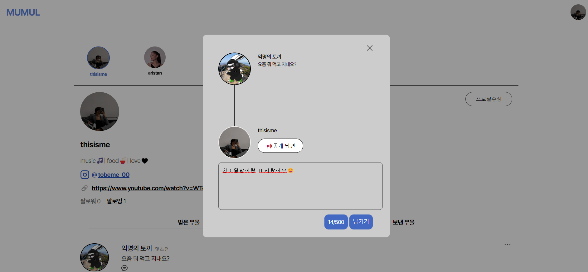
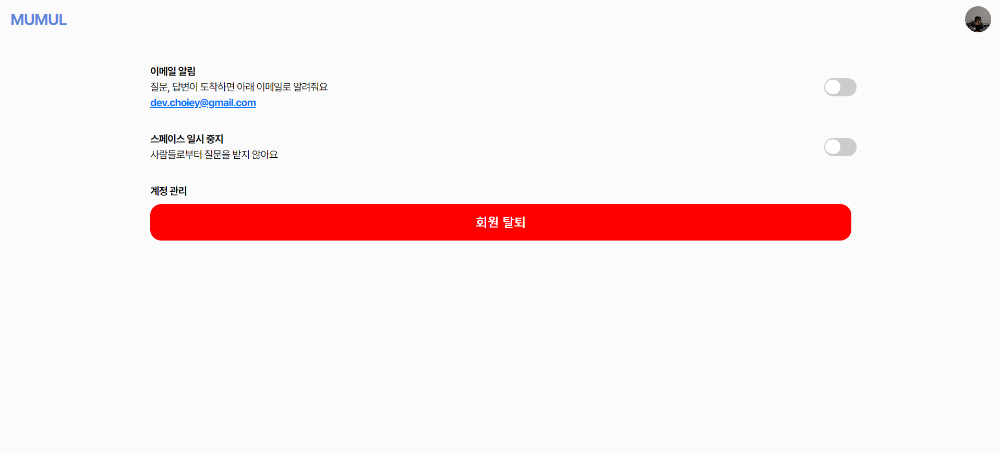

<div align="center">


[](https://hits.seeyoufarm.com)

</div>

# MUMUL
> **서울여자대학교 소프트웨어융합학과 2명의 학부생이 만든 사이드 프로젝트** <br/> **개발기간: 2023.04 ~ 2023.07**

## 배포 주소

> **개발 버전** : [https://mumul.site](https://mumul.site) <br>

## 백엔드 리포지토리 주소

> **BackEnd Repository** : [https://github.com/silver0-stack/mumul_back](https://github.com/silver0-stack/mumul_back) <br>
## 웹개발팀 소개

|      최은영       |          노수진                                                                                                                           
| :------------------------------------------------------------------------------: | :---------------------------------------------------------------------------------------------------------------------------------------------------: | 
|       |                          |                  
|   [@silver0-stack](https://github.com/silver0-stack)   |    [@suucong](https://github.com/suucong)  | 
| 서울여자대학교 소프트웨어융합학과 4학년 | 서울여자대학교 소프트웨어융합학과 3학년 | 

## 프로젝트 소개

서울여자대학교 소프트웨어융합학과 학부생 2명이 제작한 Ask Me Anything(A.K.A AMA) 커뮤니티 서비스입니다. 

MUMUL은 **'사람과 사람을 잇다'** 라는 핵심 가치 아래 개발되었습니다.  누구나 자유롭게 질문함으로써 소통합니다. 개인적인, 공개적인, 전문적인, 비전문적인 것을 가리지 않고 아울러 다루는 [MUMUL 무물(무엇이든 물어보세요)에서 스페이스를 시작하세요](https://mumul.site) ✨

누구나 ```익명의 토끼🐰``` 혹은 ```본인의 닉네임```으로 스페이스에서 자유롭게 질문할 수 있습니다. 그리고 질문받은 자는 ```공개``` 혹은 ```비공개``` 답변(질문자와 답변자만 확인 가능)으로 답변 확인 권한을 선택해서 답변할 수 있습니다.


## 시작 가이드
### Requirements
For building and running the application you need:

- ```npm 6.14.10```
- ```Node 14.15.4```

### Installation
``` bash
$ git clone https://github.com/silver0-stack/mumul_front.git
```
#### Frontend
```
$ nvm use v.1.1.10
$ npm install 
$ npm run dev
```

---

## Stacks 🐈

### Environment


             

### Config
 

### CI/CD


### Development


### Communication


---
## 화면 구성 📺
| 메인 페이지  |  로그인 페이지   |
| :-------------------------------------------: | :------------: |
|   |  |  
| 내 스페이스 페이지   |  질문 팝업창   |  
|    |       |
| 답변 팝업창   |  설정 페이지   |  
|    |       |

---
## 주요 기능 📦

### ⭐️ 익명 혹은 본인의 닉네임으로 질문 등록
- ```익명의 토끼🐰``` 와 ```본인 닉네임``` 중 선택해서 스페이스에 질문을 남길 수 있음

### ⭐️ 공개 혹은 비공개 답변 등록
- ```공개 답변```과 ```질문자에게만 공개 답변``` 중 선택해서 질문에 답변을 남길 수 있음

### ⭐️ 팔로우하기
- 팔로우하고 싶은 스페이스를 팔로우 할 수 있음

### ⭐️ 이메일 알림 기능
- 본인 스페이스에 질문 혹은 답변이 달리면 로그인한 이메일로 푸시 이메일 발송

### ⭐️본인 스페이스 중지 기능
- 질문받는 기능, 팔로우 기능 중지
   

